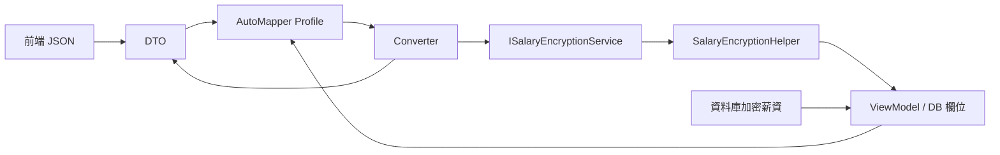
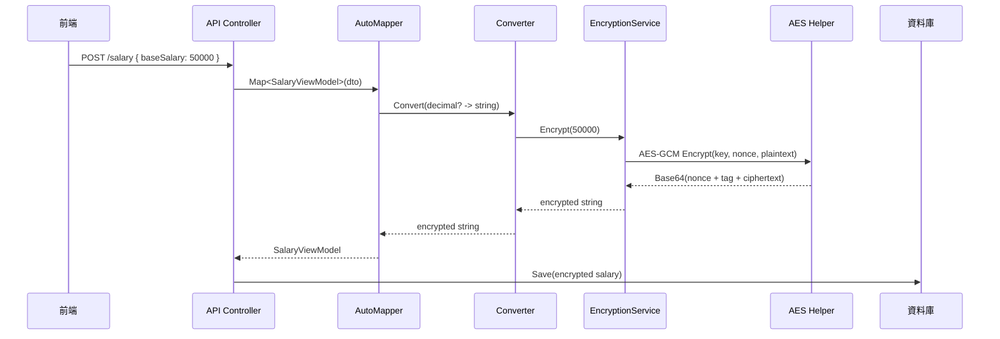

# AutoMapper 與薪資 AES 加密架構完整筆記

## Executive Summary

這份筆記的核心結論很簡單：**AutoMapper 負責決定資料如何從 DTO 映射到 ViewModel，AES-256-GCM 負責將薪資這類敏感欄位安全地加密儲存，兩者之間以 Converter 與 Service 作為銜接點**。在實作上，應將「欄位對應規則」留在 `Profile`，將「單一欄位型別轉換」留在 `IValueConverter`，將「金鑰取得、例外處理、記錄 Log」留在 `Service`，再由 `Helper` 專注執行 AES-GCM 的實際加解密。這種分工能讓 Mapping 規則清楚、測試點明確，也能避免將加密細節散落在 Controller、Service 或 Profile 中。citeturn15view0turn15view2turn15view5turn18view0turn22view1

若你的薪資欄位在 API 邊界是 `decimal?`，而在儲存或資料庫邊界是加密後的 `string`，那麼最穩定的做法是：**DTO → VM 時套用加密 Converter；VM → DTO 時套用解密 Converter**。這不是單純的同名欄位複製，而是明確的 `decimal? → string` 與 `string → decimal?` 轉換。對 AutoMapper 而言，這類轉換最適合放在 `ForMember(...).ConvertUsing(...)`；對 AES-GCM 而言，實務上應使用 **12-byte nonce** 與 **16-byte tag** 作為跨平台最穩定的預設，且**絕不能在同一把 key 下重複使用相同 nonce**。citeturn31view0turn18view4turn19view0turn24view4turn24view2

日期欄位則是另一個常見坑點。JSON 標準本身沒有原生日期型別；ASP.NET Core 預設使用 `System.Text.Json` 做 request body 反序列化，而 `System.Text.Json` 對 `DateTime` / `DateTimeOffset` 的預設支援是 ISO 8601-1:2019 擴充格式。這代表如果 DTO 把日期宣告成 `string`，就必須在 Mapping 或自訂 converter 中自行決定如何解析、如何處理空字串、以及遇到不合法格式時要回 `null`、記錄錯誤，或直接拋出例外。citeturn22view0turn17view0turn17view1turn17view2

本文以下內容採用一個明確的**工作假設**：  
**DTO** 是前端 / API 契約層；**ViewModel** 是接近儲存層或內部應用層的型別；薪資在 DTO 中以明文數字使用，在 ViewModel 中以加密字串儲存；日期欄位可能仍以字串進入 DTO，之後再映射為 `DateTime?`。這是本文為了說明而採用的建議性分層，不是框架強制規則。

## 概覽與目的

AutoMapper 的本質是「**以慣例為主、以顯式規則補足例外**」的 object-object mapper。當來源與目標欄位名稱、結構、型別足夠接近時，AutoMapper 可自動完成對應；當欄位名稱不同、需要計算、需要加解密、或需要做特殊型別轉換時，就透過 `ForMember`、`MapFrom`、`ConvertUsing` 或自訂 converter 補上規則。AutoMapper 官方文件也明確指出，它適合 DTO 與較扁平的傳輸模型映射場景，並建議在應用程式啟動時集中建立 configuration。citeturn9search2turn15view2turn16view0

在 ASP.NET Core 中，request body 預設由 JSON input formatter 處理，而預設 JSON formatter 來自 `System.Text.Json`。因此實際的資料進入流程通常是：**HTTP JSON → DTO → AutoMapper → ViewModel / Domain / Persistence**。如果其中某些欄位是敏感資料，應盡量在這個邊界上做一次性的轉換，而不是讓上層程式碼各自自行呼叫加密函式。這正是把薪資加解密整合進 AutoMapper 的價值所在：映射即轉換，轉換即保護。citeturn17view0turn15view2turn18view0

### 建議的架構關係

下圖是本筆記建議的責任分配：`Profile` 只定義規則；`Converter` 負責單一欄位的型別轉換；`Service` 負責金鑰、例外、Log 與流程；`Helper` 專心做 AES-GCM。`Profile` 本身不適合放入需要相依性注入的邏輯，因為 AutoMapper 文件明確說明 `Profile` 類別不能直接注入依賴；相反地，`IValueConverter`、`ITypeConverter` 等型別可以被 `AddAutoMapper` 自動註冊。citeturn15view3turn15view5turn16view0



### 機能流程

#### 新增或修改薪資

| 起點 | 處理者 | 動作 | 結果 |
|---|---|---|---|
| 前端表單 / API Client | ASP.NET Core JSON input formatter | 將 JSON 請求內容反序列化為 DTO | 產生 `SalaryDto` 或父層 DTO 實例 citeturn17view0turn17view1 |
| DTO | AutoMapper `Profile` | 套用類別對應規則，指定薪資欄位使用加密 converter | AutoMapper 開始處理欄位映射 citeturn15view2turn31view0 |
| 薪資欄位 | `DecimalToEncryptedConverter` | 將 `decimal?` 交給加密 service | 欄位型別由 `decimal?` 轉為 `string` citeturn31view0turn15view3 |
| 加密 service | `SalaryEncryptionService` | 讀取金鑰、處理空值、記錄錯誤、呼叫 helper | 交給 AES-GCM 實作層處理 |
| 加密 helper | `SalaryEncryptionHelper` | 以 AES-GCM 產生 nonce、ciphertext、tag，最後 Base64 編碼 | 形成可儲存的加密字串 citeturn18view2turn19view0turn20view1 |
| ViewModel / Persistence object | Repository / DbContext | 將加密字串寫入資料庫 | 薪資以密文落地 |

#### 查詢薪資

| 起點 | 處理者 | 動作 | 結果 |
|---|---|---|---|
| 資料庫 | Repository / DbContext | 取出 ViewModel / Persistence object | 取得加密薪資字串 |
| ViewModel | AutoMapper `Profile` | 套用反向映射規則，指定薪資欄位使用解密 converter | AutoMapper 開始欄位轉換 |
| 薪資欄位 | `EncryptedToDecimalConverter` | 將密文 `string` 交給解密 service | 欄位型別由 `string` 轉回 `decimal?` citeturn31view0turn15view3 |
| 解密 service | `SalaryEncryptionService` | 驗證輸入、呼叫 helper、處理例外與 Log | 交給 AES-GCM 解密 |
| 解密 helper | `SalaryEncryptionHelper` | Base64 解碼、切出 nonce / tag / ciphertext、執行 `Decrypt` | 還原明文薪資 citeturn20view2turn18view3turn19view4 |
| DTO | API Response | 序列化回前端 | 前端看到正常薪資數字 |

### 典型序列圖



## 類別分工與參考實作

### 職責總表

| 類別 | 主要責任 | 應做的事 | 不應做的事 |
|---|---|---|---|
| `Profile` | 定義映射規則 | `CreateMap`、`ForMember`、`MapFrom`、`ConvertUsing` | 不要放金鑰讀取、Log、AES 細節；也不要在 `Profile` 中注入依賴 citeturn15view5turn16view0 |
| `IValueConverter` / Converter | 單一欄位型別轉換 | `decimal? → string`、`string → decimal?` | 不要直接操作設定來源；不要把大型流程塞進 converter citeturn31view0turn15view3 |
| `ISalaryEncryptionService` | 定義加解密行為 | 提供 `Encrypt` / `Decrypt` 介面 | 不關心 AutoMapper 規則 |
| `SalaryEncryptionService` | 流程管理層 | 取金鑰、例外處理、Log、呼叫 helper | 不要承擔映射職責 |
| `SalaryEncryptionHelper` | 演算法實作層 | AES-GCM、nonce、tag、Base64 組裝與拆解 | 不要讀 `IConfiguration`、不要記錄業務 Log |
| DTO | API 邊界契約 | 承接前端資料 | 不要知道 AES 細節 |
| ViewModel / Persistence Model | 儲存邊界或應用模型 | 承載加密字串與已轉型日期 | 不要承擔映射流程控制 |

### 範例資料模型

以下範例採用本文的工作假設：DTO 供前端與 API 使用，薪資為明文 `decimal?`；ViewModel / 儲存模型將薪資保存為加密字串。日期則示範「DTO 用字串、VM 用 `DateTime?`」這種實務上常見的情況。

```csharp
public sealed class SalaryDto
{
    public decimal? BaseSalary { get; set; }
    public decimal? Allowance { get; set; }

    // 若前端傳入日期字串，可在 Mapping 階段自行解析
    public string? ContractStartDate { get; set; }
}

public sealed class SalaryViewModel
{
    // 加密後的 Base64 字串
    public string? BaseSalary { get; set; }
    public string? Allowance { get; set; }

    public DateTime? ContractStartDate { get; set; }
}

public sealed class SalaryBatchDto
{
    public List<SalaryDto>? SalaryList { get; set; }
}

public sealed class SalaryBatchViewModel
{
    public List<SalaryViewModel>? SalaryList { get; set; }
}
```

### Interface 與 Service

將外部程式碼依賴抽象化到 `ISalaryEncryptionService`，可以避免 Controller、Converter 或其他服務直接依賴某個具體加密實作。

```csharp
public interface ISalaryEncryptionService
{
    string? Encrypt(decimal? value);
    decimal? Decrypt(string? cipherText);
}
```

```csharp
using System.Globalization;
using System.Security.Cryptography;
using Microsoft.Extensions.Configuration;
using Microsoft.Extensions.Logging;

public sealed class SalaryEncryptionService : ISalaryEncryptionService
{
    private readonly ILogger<SalaryEncryptionService> _logger;
    private readonly byte[] _keyBytes;

    public SalaryEncryptionService(
        IConfiguration configuration,
        ILogger<SalaryEncryptionService> logger)
    {
        _logger = logger;

        // 建議：設定值保存 Base64 格式金鑰；正式環境改由秘鑰管理服務供應
        var keyBase64 = configuration["Encryption:SalaryKey"]
            ?? throw new InvalidOperationException("缺少薪資加密金鑰設定");

        _keyBytes = Convert.FromBase64String(keyBase64);
    }

    public string? Encrypt(decimal? value)
    {
        if (value is null)
            return null;

        try
        {
            return SalaryEncryptionHelper.EncryptDecimal(value.Value, _keyBytes);
        }
        catch (Exception ex)
        {
            _logger.LogError(ex, "薪資加密失敗");
            throw;
        }
    }

    public decimal? Decrypt(string? cipherText)
    {
        if (string.IsNullOrWhiteSpace(cipherText))
            return null;

        try
        {
            return SalaryEncryptionHelper.DecryptDecimal(cipherText, _keyBytes);
        }
        catch (FormatException ex)
        {
            _logger.LogError(ex, "薪資密文不是合法 Base64");
            throw;
        }
        catch (CryptographicException ex)
        {
            // .NET 8+ 標籤驗證失敗可表現為 AuthenticationTagMismatchException
            _logger.LogError(ex, "薪資密文驗證失敗或解密失敗");
            throw;
        }
    }
}
```

### Helper

NIST 對 GCM 提議使用 96-bit IV 以促進互通性，而 .NET 的 `AesGcm` 目前只支援 12-byte nonce；tag 則跨平台最穩定地使用 16-byte。這也是大多數 .NET 實作最安全、最直觀的預設。citeturn24view4turn18view4turn18view6

```csharp
using System.Globalization;
using System.Security.Cryptography;
using System.Text;

public static class SalaryEncryptionHelper
{
    private const int NonceSize = 12; // 96-bit
    private const int TagSize = 16;   // 128-bit

    public static string EncryptDecimal(decimal value, byte[] key, byte[]? aad = null)
    {
        var nonce = new byte[NonceSize];
        RandomNumberGenerator.Fill(nonce);

        var plaintext = Encoding.UTF8.GetBytes(
            value.ToString(CultureInfo.InvariantCulture));

        var ciphertext = new byte[plaintext.Length];
        var tag = new byte[TagSize];

        using var aes = new AesGcm(key, TagSize);
        aes.Encrypt(nonce, plaintext, ciphertext, tag, aad);

        var envelope = new byte[NonceSize + TagSize + ciphertext.Length];
        Buffer.BlockCopy(nonce, 0, envelope, 0, NonceSize);
        Buffer.BlockCopy(tag, 0, envelope, NonceSize, TagSize);
        Buffer.BlockCopy(ciphertext, 0, envelope, NonceSize + TagSize, ciphertext.Length);

        return Convert.ToBase64String(envelope);
    }

    public static decimal DecryptDecimal(string cipherText, byte[] key, byte[]? aad = null)
    {
        var envelope = Convert.FromBase64String(cipherText);

        if (envelope.Length < NonceSize + TagSize)
            throw new FormatException("密文長度不足，無法切出 nonce / tag / ciphertext");

        var nonce = envelope.AsSpan(0, NonceSize).ToArray();
        var tag = envelope.AsSpan(NonceSize, TagSize).ToArray();
        var ciphertext = envelope.AsSpan(NonceSize + TagSize).ToArray();
        var plaintext = new byte[ciphertext.Length];

        using var aes = new AesGcm(key, TagSize);
        aes.Decrypt(nonce, ciphertext, tag, plaintext, aad);

        var text = Encoding.UTF8.GetString(plaintext);
        return decimal.Parse(text, NumberStyles.Number, CultureInfo.InvariantCulture);
    }
}
```

### Converter

AutoMapper 的 value converter 是**單一 map 範圍內**的欄位值轉換；與之相對，`ITypeConverter` 是**全域型別對型別**的轉換。因為薪資加解密通常只想套用在特定欄位，而不是所有 `decimal? → string` / `string → decimal?` 的地方，所以通常更適合用 `IValueConverter` 而不是 `ITypeConverter`。citeturn31view0turn29view0

```csharp
using AutoMapper;

public sealed class DecimalToEncryptedConverter : IValueConverter<decimal?, string?>
{
    private readonly ISalaryEncryptionService _service;

    public DecimalToEncryptedConverter(ISalaryEncryptionService service)
    {
        _service = service;
    }

    public string? Convert(decimal? sourceMember, ResolutionContext context)
        => _service.Encrypt(sourceMember);
}

public sealed class EncryptedToDecimalConverter : IValueConverter<string?, decimal?>
{
    private readonly ISalaryEncryptionService _service;

    public EncryptedToDecimalConverter(ISalaryEncryptionService service)
    {
        _service = service;
    }

    public decimal? Convert(string? sourceMember, ResolutionContext context)
        => _service.Decrypt(sourceMember);
}
```

### Profile

`Profile` 的工作是告訴 AutoMapper「哪兩個型別可映射、哪些欄位需要特殊規則」。它不是拿來執行業務邏輯的地方。另一方面，AutoMapper 文件說明使用 `AddAutoMapper` 時，`IValueConverter` 等型別可以被自動註冊，因此可以在 `Profile` 中使用 **type-based** 的 `ConvertUsing`，讓 converter 由 DI 建立。citeturn15view3turn15view5turn31view0

```csharp
using System.Globalization;
using AutoMapper;

public sealed class SalaryEncryptionProfile : Profile
{
    public SalaryEncryptionProfile()
    {
        CreateMap<SalaryDto, SalaryViewModel>()
            .ForMember(
                dest => dest.BaseSalary,
                opt => opt.ConvertUsing<DecimalToEncryptedConverter, decimal?>())
            .ForMember(
                dest => dest.Allowance,
                opt => opt.ConvertUsing<DecimalToEncryptedConverter, decimal?>())
            .ForMember(
                dest => dest.ContractStartDate,
                opt => opt.MapFrom(src => DateParsing.ParseNullableDate(src.ContractStartDate)));

        CreateMap<SalaryViewModel, SalaryDto>()
            .ForMember(
                dest => dest.BaseSalary,
                opt => opt.ConvertUsing<EncryptedToDecimalConverter, string?>())
            .ForMember(
                dest => dest.Allowance,
                opt => opt.ConvertUsing<EncryptedToDecimalConverter, string?>())
            .ForMember(
                dest => dest.ContractStartDate,
                opt => opt.MapFrom(src => src.ContractStartDate.HasValue
                    ? src.ContractStartDate.Value.ToString("yyyy-MM-dd", CultureInfo.InvariantCulture)
                    : null));

        CreateMap<SalaryBatchDto, SalaryBatchViewModel>();
        CreateMap<SalaryBatchViewModel, SalaryBatchDto>();
    }
}

public static class DateParsing
{
    private static readonly string[] SupportedFormats =
    {
        "yyyy-MM-dd",
        "yyyy-MM-ddTHH:mm:ss",
        "yyyy-MM-ddTHH:mm:ssK"
    };

    public static DateTime? ParseNullableDate(string? input)
    {
        if (string.IsNullOrWhiteSpace(input))
            return null;

        if (DateTime.TryParseExact(
                input,
                SupportedFormats,
                CultureInfo.InvariantCulture,
                DateTimeStyles.AllowWhiteSpaces | DateTimeStyles.AssumeLocal,
                out var date))
        {
            return date;
        }

        throw new AutoMapperMappingException($"無效日期格式：{input}");
    }
}
```

### DI 註冊範例

```csharp
// Program.cs / Startup.cs
builder.Services.AddSingleton<ISalaryEncryptionService, SalaryEncryptionService>();

// AutoMapper 15+ 需留意授權設定；若未使用 15+，可依當前版本調整
builder.Services.AddAutoMapper(
    cfg =>
    {
        // cfg.LicenseKey = "<License Key Here>"; // AutoMapper 15+ 才需要
    },
    typeof(SalaryEncryptionProfile).Assembly);
```

如果團隊使用 AutoMapper 15 以上版本，要注意官方文件已說明 **需要授權設定**，且 `AddAutoMapper` 的 overload 會要求將 `Action<IMapperConfigurationExpression>` 放在第一個參數。citeturn30view0

## AutoMapper 設計重點

### 常用語法與用途

| 語法 | 用途 | 何時使用 | 例子 |
|---|---|---|---|
| `CreateMap<Source, Dest>()` | 建立型別對型別映射 | 一切映射起點 | `CreateMap<SalaryDto, SalaryViewModel>()` citeturn15view2turn16view0 |
| `ReverseMap()` | 產生反向映射，並支援 unflattening | 正反方向結構相近時 | `CreateMap<Order, OrderDto>().ReverseMap()` citeturn15view1 |
| `ForMember()` | 指定單一目標欄位規則 | 欄位名稱不同、型別不同、需特殊邏輯 | `ForMember(d => d.Name, ...)` citeturn31view0turn15view1 |
| `MapFrom()` | 指定來源欄位或運算式 | 欄位名稱不同、需要簡單轉換 | `MapFrom(src => src.EmployeeName)` citeturn15view1turn1search10 |
| `ConvertUsing()` | 指定使用 value converter | 特定欄位要做專門型別轉換 | 薪資加解密、幣值格式化 citeturn31view0 |
| `IValueConverter<TSourceMember, TDestMember>` | map-scoped 欄位值轉換 | 想將加密限制在某些欄位，而非全域套用 | `decimal? → string?` / `string? → decimal?` citeturn31view0 |
| `ITypeConverter<TSource, TDestination>` | 全域型別轉換 | 所有 map 遇到相同型別對都需相同行為 | `string → DateTime` 全域通用時 citeturn29view0 |

### 你真正需要記住的語意

`CreateMap<A, B>()` 只表示「建立 `A → B` 的映射」。真正執行要靠 `mapper.Map<B>(a)`。AutoMapper 官方文件也建議在啟動時集中建立 `MapperConfiguration`，而不是在程式各處隨機建立 mapping。citeturn15view2turn16view0

`ForMember(dest => dest.BaseSalary, opt => opt.ConvertUsing(...))` 代表「我要對**目標欄位** `BaseSalary` 套用特殊規則」。這裡的重點不是來源，而是目的地要怎麼被填值。當你讀到 `dest => dest.X`，就先把它理解成「我要處理目標的 X」。citeturn31view0

`MapFrom(src => src.EmployeeName)` 用於「**來源欄位**不是同名、或需要簡單投影」。`ConvertUsing(...)` 則用於「這個值需要一個**專門的值轉換器**」，例如薪資加解密、貨幣格式化，或其他跨層型別轉換。citeturn15view1turn31view0

### 實務建議

AutoMapper 最值得保留在映射層的是：**名稱對應、簡單投影、欄位格式轉換、可重複使用的欄位 converter**。不值得塞進 AutoMapper 的則是：巨大商業規則、跨多個 service 的流程編排、需要大量外部 I/O 的邏輯。官方文件也特別提到，`Profile` 不能直接注入依賴，因此若你需要使用 `IConfiguration`、`ILogger`、HTTP Context 或其他服務，應把這些相依性放在 converter / resolver / `IMappingAction` / service 裡，而不是 Profile 本身。citeturn15view5turn15view3

若要測試 mapping，最佳做法是將所有 profiles 載入後執行 `AssertConfigurationIsValid()`。這能及早發現目的地欄位拼錯、來源欄位改名、少註冊 map 或忽略必要欄位等問題。citeturn15view4turn15view2

```csharp
[Fact]
public void AutoMapper_Configuration_Should_Be_Valid()
{
    var config = new MapperConfiguration(cfg =>
    {
        cfg.AddMaps(typeof(SalaryEncryptionProfile).Assembly);
    }, loggerFactory);

    config.AssertConfigurationIsValid();
}
```

### 關於 `ReverseMap()` 的判斷

官方文件說明，`ReverseMap()` 對於 flatten / unflatten 與 `MapFrom` 的 member-access path 反推很方便；但對於像「加密」與「解密」這種**方向性完全不同的規則**，在實務上通常仍建議明確寫出雙向 map，或至少在反向方向上重新覆寫敏感欄位規則。原因不是 `ReverseMap()` 不能用，而是**可讀性與維護性**在敏感資料場景更重要。citeturn15view1

### `ProjectTo` 的限制

這一點對薪資加解密尤其重要：AutoMapper 官方明確指出，**value converters 只用在 in-memory mapping，對 `ProjectTo` 無效**；而且 `ProjectTo` 不能像 `Map` 一樣使用 DI-based resolvers / converters。換句話說，如果你打算用 EF Core 的 `ProjectTo<TDto>()` 直接在資料庫投影，**不要期待薪資加解密 converter 自動運作**。敏感欄位通常應在資料 materialize 後，再用 `Map` 做 in-memory 加解密映射。citeturn31view0turn15view3

## AES-256-GCM 技術解析

### 這裡的 AES-GCM 到底是什麼

NIST SP 800-38D 定義了 GCM（Galois/Counter Mode）作為一種 **authenticated encryption with associated data** 模式；RFC 5116 將這類演算法抽象成 AEAD，強調它同時提供**機密性**與**完整性保護**。對你的薪資場景來說，這代表系統不只是把數字「藏起來」，還能在解密時檢查密文是否被竄改。citeturn18view0turn22view1

AES 本身是 NIST 標準化的對稱式區塊密碼，支援 128、192、256-bit 金鑰；所謂 AES-256，就是使用 256-bit key。AES 的 block size 固定是 128 bits。GCM 則是 AES 的一種 mode of operation。citeturn18view1turn23view0

### 核心術語

| 名稱 | 定義 | 在這個薪資架構中的實際角色 |
|---|---|---|
| Plaintext | 原始明文資料 | 例如 `50000.00` |
| Key | 對稱式金鑰 | 決定誰能加密與解密；AES-256 代表 32-byte key citeturn18view1turn18view6 |
| Nonce / IV | 每次加密唯一值 | 同一把 key 下**不能重複**；.NET `AesGcm` 只支援 12-byte nonce，NIST 也建議使用 96-bit IV citeturn19view0turn18view4turn24view4 |
| Ciphertext | 加密後密文 | 寫入資料庫的主要內容之一 |
| Tag | 驗證標籤 | 用來確認密文、nonce、AAD、key 是否一致；tag 驗證失敗時解密不應成功 citeturn19view4 |
| AAD | Additional Authenticated Data | 可驗證但不加密的附加資料；例如未來可綁定 `TenantId` / `EmployeeId` citeturn19view3turn19view4 |
| Base64 | 位元組轉字串編碼 | 方便存入 DB / JSON；它不是加密本身 citeturn20view1turn20view2 |

### 建議的預設參數

對 .NET `AesGcm` 而言，最穩健的跨平台預設為：

| 項目 | 建議值 | 依據 |
|---|---|---|
| Key 長度 | 32 bytes | AES-256 使用 256-bit key citeturn18view1turn18view6 |
| Nonce 長度 | 12 bytes | .NET `AesGcm` 只支援 96-bit nonce，NIST 亦建議 96-bit IV citeturn18view4turn24view4 |
| Tag 長度 | 16 bytes | 最佳跨平台穩定值；Apple 平台 tag 受限為 16 bytes citeturn18view4turn18view6 |

### 加密與解密的實際步驟

#### 加密

| 起點 | 處理者 | 動作 | 結果 |
|---|---|---|---|
| `decimal?` 薪資 | Service / Helper | 將數值轉成字串，再轉為 UTF-8 byte[] | 形成 plaintext bytes |
| plaintext bytes | `RandomNumberGenerator` | 產生密碼學強隨機 nonce | 每次加密都不同 citeturn20view0 |
| key + nonce + plaintext | `AesGcm.Encrypt` | 產生 ciphertext 與 tag | 形成 AEAD 輸出 citeturn18view2turn19view3 |
| nonce + tag + ciphertext | Base64 編碼 | 轉為可儲存字串 | 寫入 DB 的密文字串 citeturn20view1 |

#### 解密

| 起點 | 處理者 | 動作 | 結果 |
|---|---|---|---|
| Base64 密文字串 | `Convert.FromBase64String` | 轉回 byte[] | 拿回 envelope citeturn20view2 |
| envelope | Helper | 切出 nonce / tag / ciphertext | 準備解密 |
| key + nonce + tag + ciphertext | `AesGcm.Decrypt` | 驗證 tag，若成功則輸出 plaintext | 取得原始明文 bytes citeturn18view3turn19view4 |
| plaintext bytes | Helper / Service | UTF-8 轉字串，再 parse 為 `decimal` | 回到 API 可用的薪資數字 |

### 為什麼 nonce 這麼重要

.NET 文件直接指出：**AES-GCM 的安全保證要求，在相同 key 下絕不能重複使用同一個 nonce**。NIST 也在 IV 章節中將唯一性視為核心要求。實務上這意味著：**你不能拿 deterministic 的常數 nonce 去加密薪資**；也不能為了「讓相同薪資加密後結果相同」而重用 nonce。對稱金鑰 + nonce 重複，是 GCM 最不能犯的錯之一。citeturn19view0turn23view0turn24view5

這也帶來一個很重要的產品層面後果：**同一個薪資值，即使用同一把 key，多次加密後也不應期待產生相同密文**。因此若未來有「用密文字串比對薪資是否相同」的需求，應先重新檢討設計。

### Tag 與竄改偵測

`AesGcm.Decrypt` 會要求 caller 提供 **正確的 key、nonce、ciphertext、tag，若使用 AAD，AAD 也必須完全一致**。若 tag 驗證失敗，.NET 8+ 會以 `AuthenticationTagMismatchException` 表示，且文件說明此時 plaintext 會被清空；較早版本則通常表現為 `CryptographicException`。citeturn19view4turn19view2

這個特性正是薪資欄位使用 AEAD 模式的重要價值：如果有人直接去改資料庫中的密文，只要密文被戳壞、截斷、或 tag / nonce 對不上，解密就會失敗，而不是靜默回傳錯誤數字。citeturn19view4

### AAD 是否要用

GCM 支援 AAD（Additional Authenticated Data），也就是**不加密但會一起驗證**的資料。現在你的薪資欄位即使不使用 AAD 也能安全工作；但若未來想把密文與某些上下文綁死，例如 `TenantId`、`EmployeeId`、`CompanyId`，就可以把這些識別資訊當作 AAD 傳入。這樣做的效果是：密文就算被複製到其他員工或其他租戶，也會因 AAD 不符而無法通過驗證。citeturn19view3turn19view4

### Base64 的角色

`Convert.ToBase64String` 與 `Convert.FromBase64String` 做的是**表示轉換**：將 byte[] 編碼成 Base64 字串，或再還原回 byte[]。它讓你比較容易把 binary 資料放進資料庫字串欄位、訊息佇列或 JSON 結構，但它不是加密功能。真正提供機密性與完整性的，是前一步的 AES-GCM。citeturn20view1turn20view2

### 常見錯誤與防護建議

| 問題 | 常見症狀 | 原因 | 建議處理 |
|---|---|---|---|
| key 長度錯誤 | 建立 `AesGcm` 時拋例外 | key 不是 16 / 24 / 32 bytes | 明確使用 32-byte key，並在啟動時驗證設定值長度 citeturn18view6turn18view1 |
| nonce 重複 | 安全性喪失，風險極高 | 相同 key 下重複使用 nonce | 永遠使用唯一 nonce；預設用 `RandomNumberGenerator.Fill` 產生 12-byte nonce citeturn19view0turn20view0turn24view4 |
| tag 驗證失敗 | 解密失敗、出現 `AuthenticationTagMismatchException` 或 `CryptographicException` | 密文被改、tag 不符、AAD 不符、key 不符 | 記錄安全事件、不要回傳部分結果、視為資料損毀或攻擊 citeturn19view4turn19view2 |
| Base64 解析失敗 | `FormatException` | 字串不是合法 Base64，或 DB 欄位被截斷 | DB 欄位長度留足；解密前集中捕捉 `FormatException` citeturn20view2 |
| tag 長度跨平台不一致 | 某些平台成功、某些平台失敗 | Apple 平台 tag 長度受限為 16 bytes | 若需跨平台，固定使用 16-byte tag citeturn18view4 |
| 在 `appsettings.json` 或原始碼保存正式環境 key | 秘鑰外洩風險高 | 不安全的 secrets 管理 | 開發用 User Secrets；正式環境用 Key Vault / secret manager / KMS，且不要把 secrets 佈署進應用程式 citeturn21view1turn21view0turn21view2turn21view3 |

### 金鑰儲存方式

這裡明確給出**建議**與**假設**：

| 環境 | 建議作法 | 備註 |
|---|---|---|
| 開發環境 | `.NET User Secrets` | Microsoft 明確說明 User Secrets 不加密，僅適合開發用途 citeturn21view1 |
| 正式環境 | Azure Key Vault、KMS、集中式 secret manager | Microsoft 與 OWASP 都建議不要把 secrets 放進原始碼與一般設定檔，並建議用受控方式管理與輪替 secrets citeturn21view1turn21view0turn21view2turn21view3 |
| 高要求場景 | DEK / KEK 分離 | OWASP 建議將資料加密金鑰與 key-encryption-key 分離，避免金鑰與資料同點失陷 citeturn21view0 |

## 日期與集合 Mapping 實務

### 為什麼前端常常把日期送成字串

JSON 標準規定的 value 類型是 object、array、number、string、`false`、`null`、`true`；**沒有獨立的日期 literal**。因此日期在 JSON 中通常以字串表示。ASP.NET Core 預設用 `System.Text.Json` 做 request body 反序列化，而 `System.Text.Json` 對 `DateTime` / `DateTimeOffset` 的預設支援採用 ISO 8601-1:2019 擴充格式；若內容不符合格式，會拋 `JsonException`。citeturn22view0turn17view0turn17view1turn17view2

這代表你有兩種主要設計選擇：

| DTO 日期型別 | 優點 | 代價 | 何時適合 |
|---|---|---|---|
| `DateTime?` | 讓 ASP.NET Core / `System.Text.Json` 直接幫你解析 ISO 日期 | 前端 payload 必須更規範；不合法格式會在反序列化階段直接失敗 citeturn17view1turn17view2 | 前後端日期格式一致、契約成熟時 |
| `string?` | 可接受空字串、非標準來源、前端暫時不穩定 payload | 你必須自行解析、驗證、定義失敗策略 | 遷移期、需兼容多種前端或舊系統時 |

### 安全的日期寫法

`DateTime.ParseExact` 與 `Parse` 的差異在於：`ParseExact` 對格式要求嚴格，且不符合時會丟例外；`TryParseExact` 則在格式不符時回傳 `false`。如果你是在 mapping 階段做日期轉換，**通常推薦 `TryParseExact` 或 `TryParse`**，以便把錯誤控制得更可預期。citeturn27view2turn27view1turn27view0

### 推薦的日期解析範例

```csharp
using System.Globalization;

public static class SafeDateParser
{
    private static readonly string[] SupportedFormats =
    {
        "yyyy-MM-dd",
        "yyyy-MM-ddTHH:mm:ss",
        "yyyy-MM-ddTHH:mm:ssK"
    };

    public static DateTime? ParseNullable(string? input)
    {
        if (string.IsNullOrWhiteSpace(input))
            return null;

        if (DateTime.TryParseExact(
                input,
                SupportedFormats,
                CultureInfo.InvariantCulture,
                DateTimeStyles.AllowWhiteSpaces | DateTimeStyles.AssumeLocal,
                out var result))
        {
            return result;
        }

        return null; // 也可以改成 throw，視 API 契約而定
    }
}
```

```csharp
CreateMap<AppointmentUpdateDto, AppointmentUpdateViewModel>()
    .ForMember(
        dest => dest.ContractStartDate,
        opt => opt.MapFrom(src => SafeDateParser.ParseNullable(src.ContractStartDate)))
    .ForMember(
        dest => dest.ContractEndDate,
        opt => opt.MapFrom(src => SafeDateParser.ParseNullable(src.ContractEndDate)))
    .ForMember(
        dest => dest.ExpectedWorkDate,
        opt => opt.MapFrom(src => SafeDateParser.ParseNullable(src.ExpectedWorkDate)));
```

如果你的前端與後端已全面採用 ISO 8601，則可以考慮讓 DTO 直接使用 `DateTime?`，減少一層手工解析；這時 AutoMapper 在來源與目標欄位型別同為 `DateTime?` 的情況下，通常不需要額外寫 `ForMember`。citeturn17view1turn17view2turn15view2

### 父子集合 Mapping

AutoMapper 文件指出：**映射集合時，只需要設定元素型別 mapping，不需為每種 `List<T>` / `IEnumerable<T>` 額外建立 mapping**。例如只要有 `CreateMap<SalaryDto, SalaryViewModel>()`，就能映射 `List<SalaryDto>` 到 `List<SalaryViewModel>`。citeturn14view0

```csharp
CreateMap<SalaryDto, SalaryViewModel>();
CreateMap<SalaryBatchDto, SalaryBatchViewModel>();
```

同理，對巢狀物件而言，只要內層型別 map 已註冊，父層 `Map` 時就能自動使用內層 map。官方文件也說明：`Map` 呼叫不需要另外指定 inner type mappings，只要 configuration 中已有對應設定即可。citeturn14view1

### 集合 Mapping 的常見坑

| 狀況 | 現象 | 原因 | 處理建議 |
|---|---|---|---|
| 缺少子元素 map | `Missing type map configuration`、或執行時失敗 | 只有父層 map，沒有 `SalaryDto → SalaryViewModel` | 先補齊元素型別 map citeturn14view0turn14view1 |
| 缺少父層 map | 父物件無法整體轉換 | 只有子層 map，未定義 Batch / Parent map | 父層與子層都要有 map |
| source 集合為 `null` | 目標通常成為空集合，不是 `null` | AutoMapper 對 collection property 的預設行為如此 | 若想保留 `null`，設 `AllowNullCollections = true` citeturn14view0 |
| 非泛型 enumerable | AutoMapper 無法猜型別 | 只有 assignable / unmapped type 才好處理 | 優先使用 `List<T>` / `IEnumerable<T>` 等泛型集合 citeturn14view0 |

### 一個對團隊很有用的原則

若你遇到的是**名稱不同**，先想 `MapFrom()`；  
若你遇到的是**值需要專門轉換**，再想 `ConvertUsing()`；  
若你遇到的是**整個型別對型別都需要同一套解法**，才考慮 `ITypeConverter`。這個判斷順序，通常能避免把相對單純的 mapping 問題做得太重。citeturn31view0turn29view0

## 新功能整合清單與實作建議

### 整合檢查清單

| 面向 | 檢查問題 | 建議 |
|---|---|---|
| 型別設計 | DTO 的薪資是 `decimal?` 嗎？VM / DB 邊界是 `string` 嗎？ | 將「明文數字」與「密文字串」分層清楚 |
| Mapping | 是否同時建立正向與反向 map？ | 敏感欄位建議雙向都明確設定 |
| Converter | 是否為敏感欄位使用 `IValueConverter`？ | 避免把所有 `decimal? → string` 都全域加密 |
| 日期 | DTO 日期到底是 `string?` 還是 `DateTime?`？ | 若用 `string?`，集中解析邏輯並定義失敗策略 |
| 集合 | 父層 map 與子元素 map 都有嗎？ | 缺一不可 |
| DI | `ISalaryEncryptionService`、converters 是否註冊？ | 使用 `AddAutoMapper` 掃描 profile / converters citeturn15view3turn16view0 |
| 金鑰管理 | key 是否在正式環境使用 secret manager / vault？ | 不要把正式 key 寫進程式碼或一般設定檔 citeturn21view1turn21view0 |
| DB 欄位 | 欄位長度足夠嗎？ | 避免密文被截斷導致解密驗證失敗 |
| 例外與 Log | 是否有集中處理 Base64 / Crypto 例外？ | Service 層統一記錄與轉譯錯誤 |
| 測試 | 是否有 mapping 驗證與 round-trip 測試？ | `AssertConfigurationIsValid` + Encrypt/Decrypt 單元測試 citeturn15view4 |

### 我會建議你實際落地時採取的做法

第一，將薪資加解密**定位成映射規則的一部分**，而不是 Controller 呼叫 helper 的零散行為。這會讓你的新增 / 查詢流程一致，也比較不容易在新功能時漏加密。AutoMapper 的設計本來就非常適合這種「欄位值轉換」工作。citeturn31view0turn15view2

第二，把金鑰來源與 AES-GCM 隔開。`SalaryEncryptionService` 應只暴露 `Encrypt` / `Decrypt`，底層由 `Helper` 處理 AES 細節。這樣未來若金鑰改由 Key Vault、Managed Identity、KMS provider 或 envelope encryption 供應時，不必改動 Mapping 規則。OWASP 與 Microsoft 都傾向這種集中式 secrets 管理方式。citeturn21view0turn21view1turn21view2turn21view3

第三，對日期欄位建立**單一、可重用的解析函式**，不要在每個 `Profile` 中重複貼 `string.IsNullOrWhiteSpace ? ... : DateTime.Parse(...)`。你真正想維護的不是 `Parse` 語法，而是「我們系統接受哪些日期格式、空字串算不算 null、格式錯誤回什麼」。這些規則應集中在一個地方。citeturn27view1turn27view0turn17view1

第四，明確區分 `Map` 與 `ProjectTo` 的使用場景。若需要真正執行以 DI 為基礎的 converter，加解密應該在 `Map` 階段完成；若你用 `ProjectTo`，要非常保守，因為 AutoMapper 官方文件已明說 value converters 不會在 `ProjectTo` 中工作。citeturn31view0turn15view3

第五，為這條流水線建立三層測試：  
一是 **mapping configuration test**；  
二是 **加密 round-trip test**（明文 → 加密 → 解密 → 明文）；  
三是 **異常測試**（錯 key、爛 Base64、被篡改密文、空字串日期、不合法日期）。  
這三種測試能大幅降低日後新功能整合時的 regressions。citeturn15view4turn19view4turn20view2turn27view1

## 總結與最佳實務建議

如果要把整套做法濃縮成一句話，那就是：

**Profile 決定怎麼對應，Converter 決定欄位怎麼轉，Service 管理金鑰與例外，Helper 執行 AES-GCM；日期與集合則應用同樣的原則——把規則集中、把方向寫清楚、把錯誤處理收斂在可測試的位置。**

從官方設計取向來看，這樣的做法與 AutoMapper 的使用方式一致：集中 configuration、以 `Profile` 組織映射、用 `AssertConfigurationIsValid()` 驗證設定、用 `IValueConverter` 處理 member-level 轉換、避免把依賴注入到 `Profile`。從加密角度來看，這樣的做法也符合 NIST 與 .NET 對 AES-GCM 的要求：適當的 key size、唯一 nonce、驗證 tag、以 Base64 作為儲存表示、將金鑰交給專門的 secrets 管理機制。citeturn15view2turn15view4turn15view5turn31view0turn18view0turn18view4turn19view0turn21view0turn21view1

在團隊維運層面，這種分工還有一個額外好處：**新功能加入時，你主要只需要新增 DTO / VM、補 `CreateMap`、對敏感欄位補 `ConvertUsing`、確認父子 map 鏈完整、加上測試，而不是重新設計整套加密機制。** 也就是說，框架是可複用的，新增功能只是往框架中增加新的型別與規則。這會讓日後的維護成本穩定許多。

### What to do next

1. 先把現有薪資相關 DTO / VM / DB 欄位做一次盤點，明確標記哪些欄位是「明文數字」、哪些欄位是「密文字串」。
2. 建立或整理 `SalaryEncryptionProfile`、兩個 converter、`ISalaryEncryptionService` / `SalaryEncryptionService` / `SalaryEncryptionHelper`，將責任切乾淨。
3. 補上 `AssertConfigurationIsValid()` 測試，以及至少一組薪資 round-trip 測試與一組密文損毀測試。
4. 決定正式環境的金鑰管理方案；若目前還在 `appsettings`，請排入改用 Key Vault / secret manager 的工作。
5. 對日期欄位建立共用解析函式，並把所有 `string → DateTime?` 的 mapping 改成集中式的安全寫法。
